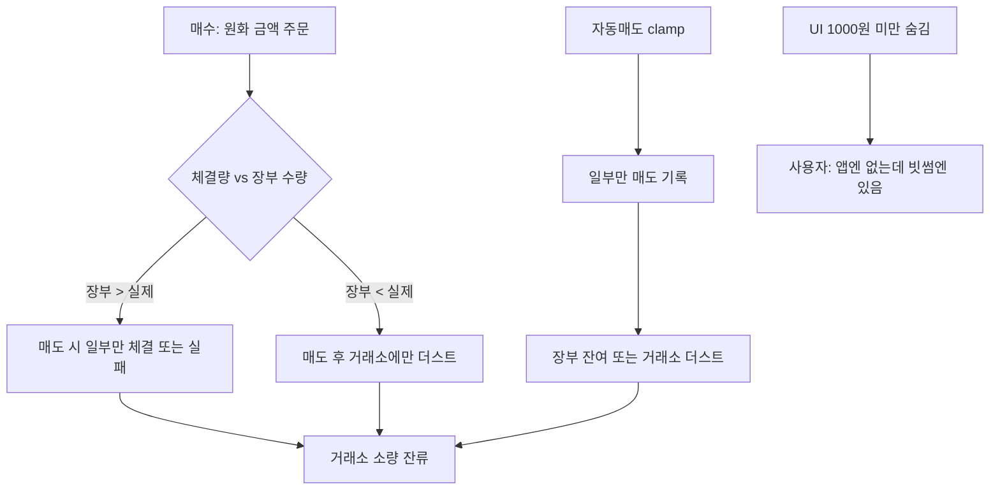

# 코인 소량 잔량(더스트) 잔류 — 원인 분석 및 개선안

- 작성: 2026-05-26
- 대상: 자동매매(빗썸 실매매·박스권·일반 자동매도) 후 **미체결 주문이 아닌** 거래소 지갑에 남는 소량 코인

---

## 1. 현상 정리

| 구분 | 설명 |
|------|------|
| 사용자 인지 | 빗썸(또는 거래소 앱)에는 코인이 조금 남아 있음 |
| 앱(Stock) | 해당 프로그램 보유·포지션이 **이미 청산된 것처럼** 보이거나, 아예 목록에 안 보임 |
| 미체결 | 사용자 확인 — **대기 주문·부분 체결 대기가 아님** |

→ **장부(앱) 수량과 거래소 실제 잔고의 불일치**, 또는 **매도 시 일부만 팔고 장부/거래소 모두 잔량** 두 유형으로 나뉩니다.

---

## 2. 코드 기준 원인 (우선순위)

### 2-1. 매수 기록 수량 ≠ 빗썸 실제 체결량 (핵심)

**위치**: `live-trade-runner.js` → `executeBithumbLiveBuyOrder` → `recordLiveTradeBuyAsync`

- 빗썸 매수는 `ord_type=price`(원화 금액)로 주문하고, `pollBithumbOrderFill`로 **실제 `executed_volume`** 을 받을 수 있음.
- 그러나 포트폴리오 기록은 `recordLiveTradeBuySync`에서  
  `quantity = quantityFromOrderAmount(orderAmountKrw, price, "crypto")`  
  즉 **「설정 원화 ÷ 시세」를 8자리 반올림한 값**만 저장함.
- **체결량(`executed_volume`)은 매수 기록에 반영되지 않음.**

**결과**

- 장부 수량이 실제 지갑보다 크면 → 매도 시 주문 거절·부분 체결·슬리피지 보류 후 **거래소에 실제 보유분만 남음**.
- 장부 수량이 실제보다 작으면 → 매도 후에도 거래소에 **장부에 없는 더스트**가 남음.

---

### 2-2. 자동매도 시 「주문 가능(balance)」으로 수량 깎기 (부분 매도)

**위치**: `live-trade-auto-sell.js` + `clampBithumbSellVolumeToAvailable` (`live-trade-bithumb-reconcile.js`)

```text
sellVolume = min(앱 보유 수량, 빗썸 balance 주문가능)
recordLiveTradeSellSync(quantity: sellVolume)  // 깎인 수량만 기록
```

- `balance`(주문 가능)만 사용. `locked`는 제외.
- **한 계정에 여러 프로그램이 같은 코인을 보유**하면, 프로그램 A 매도 시 전체 `available`을 쓰므로 **다른 프로그램 몫까지 팔거나**, 반대로 **available 부족으로 일부만 매도**할 수 있음.
- `clamped`일 때 로그만 남기고, **남은 수량에 대한 즉시 재매도·더스트 정리는 없음.**

**결과**

- 앱 장부: `pos.quantity - sellVolume` 만큼 **아직 보유 중**으로 남을 수 있음.
- 거래소: 매도 후에도 **최소 주문 단위 미만**이면 추가 매도 불가 → 더스트.

---

### 2-3. 박스권 매도는 거래소 잔고 clamp 없음

**위치**: `box-range/runner-fsm.js` (TP/SL 도달 시 `executeBithumbLiveSellOrder`)

- 자동매도와 달리 **`clampBithumbSellVolumeToAvailable` 미사용**.
- `resolveBoxSellQuantitySync`의 **장부 수량** 그대로 시장가 매도.
- 장부 > 거래소 가능 수량이면 실패·부분 체결; 장부 < 거래소면 **매도 후 거래소에 더스트**.

---

### 2-4. UI에서 소액 보유 숨김 (1,000원 미만)

**위치**: `live-trade-bithumb-holdings.js` — `MIN_DISPLAY_KRW = 1_000`

- 평가액 1,000원 미만 코인은 **보유 목록에서 제외**.
- 거래소에는 남아 있으나 Stock UI에는 **「없는 것처럼」** 보임 → 「안 팔리고 남았다」로 느껴짐.

---

### 2-5. 빗썸 최소 주문·반올림

**위치**: `live-trade-market.js` — crypto 수량 `1e-8` 반올림, 매수 최소 10,000원

- 시장가 매도 후에도 **원화 환산 5,000~10,000원 미만** 잔량은 빗썸에서 **추가 매도 주문 불가**인 경우가 많음 (거래소 정책).
- 앱은 「포지션 0」으로 장부 정리해도 **물리 잔고는 영구 더스트**.

---

### 2-6. 잔고 동기화 시 「장부만」 청산

**위치**: `reconcileBithumbHoldingsForUser` — `EXCHANGE_ZERO_RATIO = 0.02`

- 거래소 수량이 앱의 2% 미만이면 「거래소에서 이미 팔림」으로 보고  
  **`pos.quantity` 전량을 매도 체결로 기록** (실제 거래소 더스트 매도는 안 함).
- 수동 매도로 대부분 팔고 **극소량만 남은 경우**에도 동일.

---

### 2-7. 기타 (부차)

| 항목 | 영향 |
|------|------|
| 매도 슬리피지 검사 실패 시 주문 보류 | 포지션·잔고 그대로 유지 |
| `pollBithumbOrderFill` 최대 3회·2초 간격 | 체결 조회 실패 시 기록 수량만 더 어긋날 수 있음 |
| 수수료를 원화로만 장부 반영 | 코인 단위 수수료 차감과 미세 불일치 가능 |

---

## 3. 시나리오별 「남는」 모양



---

## 4. 개선안 (권장 순서)

### P0 — 즉시 (정확도)

1. **매수·매도 모두 빗썸 `executed_volume` 기준 장부 기록**
   - `executeBithumbLiveBuyOrder` / `executeBithumbLiveSellOrder` 반환에 `fillVolume` 추가.
   - `recordLiveTradeBuyAsync` / `recordLiveTradeSellSync`는 **체결량 우선**, 없을 때만 기존 추정식.
2. **모든 실매매 코인 매도 경로에 `clampBithumbSellVolumeToAvailable` 통일**
   - `box-range/runner-fsm.js` 포함.
   - 매도 후 `available` 재조회 → **잔여 ≥ 최소주문이면 1회 추가 매도(sweep)**.

### P1 — 단기 (운영)

3. **더스트 스윕(sweep) 폴링** (armed 프로그램·빗썸 계정)
   - 프로그램 포지션 0인데 거래소 `balance` > 0 인 base 수집.
   - 원화 환산 ≥ `CRYPTO_MIN_ORDER_KRW`(1만원)이면 시장가 전량 매도 + 장부 「dust_close」 기록.
   - 미만이면 UI에 **「정리 불가 더스트 (약 N원)」** 표시만.
4. **다중 프로그램 동일 코인**
   - 매도 전 exchange `available`을 **프로그램별 비례 배분** 또는 「한 프로그램만 실매매 코인 허용」 정책 문서화.
5. **`MIN_DISPLAY_KRW` 완화**
   - 숨기지 말고 「더스트」섹션으로 표시 (예: 500원 이상도 표시).

### P2 — 중기 (관측·복구)

6. **매도 성공 후 검증 틱**
   - `exQty / appQty < 0.98` 이면 경고 + 텔레그램/로그 `[live-trade:dust-warning]`.
7. **관리 API**: `POST /api/live-trading/bithumb/sweep-dust` (본인 계정·dry-run).
8. **reconcile 개선**
   - 장부 청산 시 거래소 잔량도 로그에 남기고, 남은 양이 최소주문 이상이면 sweep 시도.

---

## 5. 당장 사용자가 할 수 있는 것

1. 빗썸 앱에서 해당 코인 **시장가 전량 매도** (원화 1만원 이상일 때).
2. Stock **실매매 → 보유·거래내역**에서 같은 심볼 프로그램이 아직 「보유」로 남아 있으면 → 프로그램 중지 후 수동 정리.
3. 서버 로그 검색: `[live-trade:auto-sell] 매도 수량 조정`, `[box-range:sell]`, `빗썸 주문가능 수량 없음`.

---

## 6. 구현 시 예상 효과

| 개선 | 기대 효과 |
|------|-----------|
| 체결량 기록 | 장부·거래소 불일치 **대폭 감소** |
| 매도 clamp + sweep | 자동매도·박스권 후 **의도치 않은 잔량 감소** |
| 더스트 UI | 「안 보이는 잔고」 인지 가능 |
| 다중 프로그램 정책 | 동일 코인 **과매도/과소매도** 방지 |

---

## 7. 관련 파일 (개발 참고)

| 파일 | 역할 |
|------|------|
| `server/live-trade-portfolio-store.js` | `quantityFromOrderAmount`, 포지션 집계 |
| `server/bithumb-trading-adapter.js` | 매수/매도, `pollBithumbOrderFill` |
| `server/live-trade-auto-sell.js` | 목표가·손절 자동매도, clamp |
| `server/live-trade-bithumb-reconcile.js` | clamp, 잔고 동기화 |
| `server/box-range/runner-fsm.js` | 박스권 TP/SL 매도 |
| `server/live-trade-bithumb-holdings.js` | `MIN_DISPLAY_KRW` 필터 |

---

*본 문서는 저장소 코드 정적 분석 기준이며, 실제 빗썸 API 최소 주문 규칙은 운영 환경에서 한 번 더 확인하는 것이 좋습니다.*
