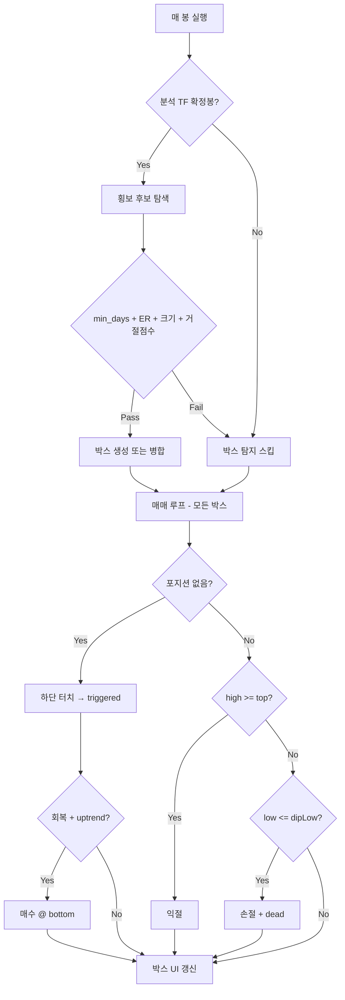
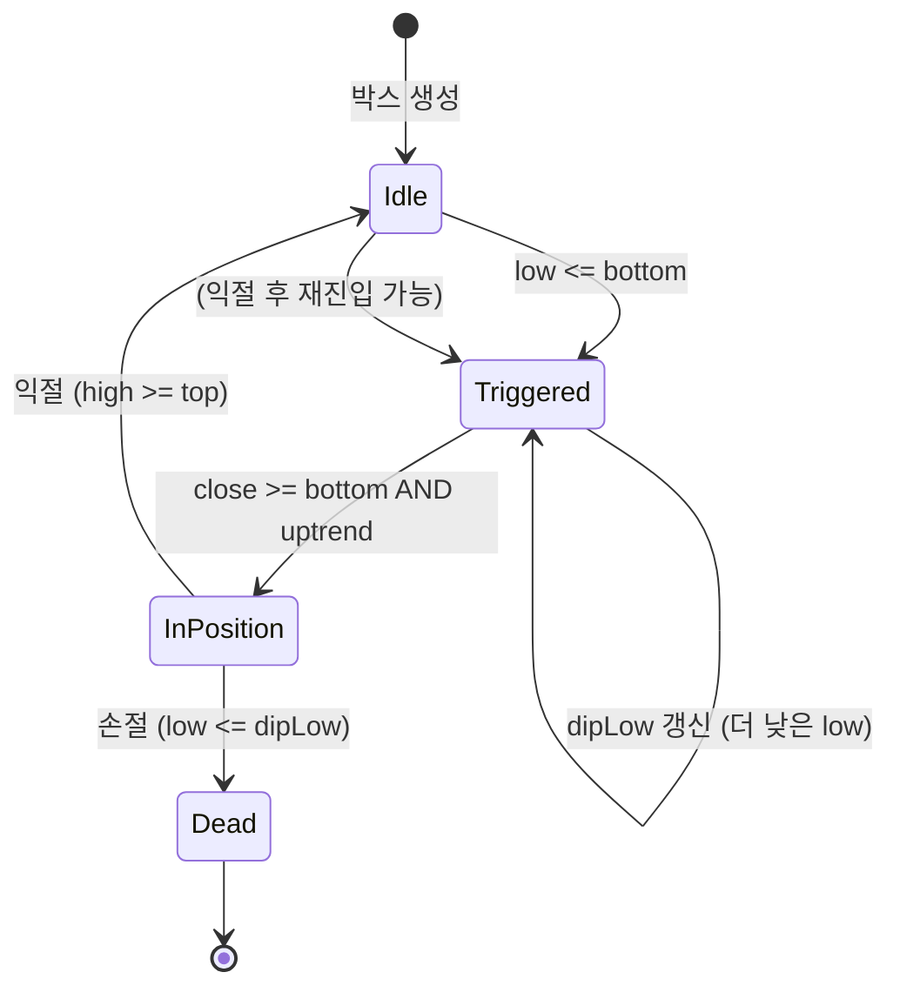

# 통합 박스권 PRO V2 + MA 추세 — 매매전략 상세 보고서

> **대상 파일:** `scripts/pine-box-range-pro-v2-ma.pine`  
> **작성 기준:** Pine Script v5, indicator(오버레이)  
> **전략 한 줄 요약:** 횡보(박스권) 구간을 통계적으로 탐지한 뒤, **박스 하단 터치 → 회복** 시점에 **일봉 MA 상승추세**가 확인되면 매수하고, **박스 상단**에서 익절·**바닥 이탈 저점**에서 손절한다.

---

## 목차

1. [전략 개요](#1-전략-개요)
2. [전체 흐름도](#2-전체-흐름도)
3. [입력 파라미터 전체](#3-입력-파라미터-전체)
4. [타임프레임·실행 조건](#4-타임프레임실행-조건)
5. [Phase A — 박스권 탐지](#5-phase-a--박스권-탐지)
6. [Phase B — 박스 경계 계산 (V2 핵심)](#6-phase-b--박스-경계-계산-v2-핵심)
7. [Phase C — 박스 확장·병합·연장](#7-phase-c--박스-확장병합연장)
8. [Phase D — 일봉 MA 추세 필터](#8-phase-d--일봉-ma-추세-필터)
9. [Phase E — 매매 상태 머신](#9-phase-e--매매-상태-머신)
10. [매수·익절·손절 상세 규칙](#10-매수익절손절-상세-규칙)
11. [박스별 저장 데이터](#11-박스별-저장-데이터)
12. [차트 표시·색상·통계](#12-차트-표시색상통계)
13. [봉별 실행 순서 (코드 실행 타이밍)](#13-봉별-실행-순서-코드-실행-타이밍)
14. [과거 vs 실시간 — 동일성 분석](#14-과거-vs-실시간--동일성-분석)
15. [실거래 적용 시 주의사항](#15-실거래-적용-시-주의사항)
16. [시나리오 예시 (일봉 기준)](#16-시나리오-예시-일봉-기준)
17. [용어 사전](#17-용어-사전)

---

## 1. 전략 개요

### 1.1 무엇을 하는 전략인가

| 구분 | 내용 |
|------|------|
| **시장 가정** | 가격이 일정 기간 **좁은 범위(박스)** 안에서 횡보한 뒤, 하단에서 지지받고 상단으로 반등할 가능성이 있다 |
| **진입 아이디어** | 박스 **하단(지지)** 터치 후 **종가가 하단 위로 회복** + **일봉 MA 정배열(상승추세)** |
| **청산 아이디어** | **익절:** 박스 상단 도달 / **손절:** 진입 후 형성된 **눌림 저점(dipLow)** 재이탈 |
| **핵심 차별점 (V2)** | 단순 고저가가 아니라 **80/20 퍼센타일 + POC(거래량 중심)** + **상·하단 거절(rejection) 점수** + **ER(효율성 비율)** 로 “진짜 횡보”만 필터 |

### 1.2 전략 유형 분류

```
[횡보 탐지] → [박스 확정] → [하단 터치 대기] → [회복 + MA필터] → [매수]
                                                      ↓
                              [상단 터치] → 익절    /    [dipLow 이탈] → 손절(박스 dead)
```

### 1.3 이 indicator의 성격

- TradingView **indicator** (strategy 아님) → 주문 실행·슬리피지·수수료 시뮬 없음
- 통계(승률·누적%)는 **가격 기준 단순 %** 계산
- 체결가는 코드상 **`bottom`(박스 하단선)** 으로 고정 기록 (실제 체결가와 다를 수 있음)

---

## 2. 전체 흐름도



---

## 3. 입력 파라미터 전체

### 3.1 기본·확장

| 파라미터 | 기본값 | 범위 | 의미 |
|----------|--------|------|------|
| `active_tf` | `"D"` | 60 / 240 / D | **박스를 탐지할** 타임프레임 (차트 TF와 별개) |
| `min_days` | 10 | ≥8 | 횡보로 인정할 **최소 연속 봉 수** |
| `max_expand` | 120 | 20~300 | 박스 좌·우로 확장 탐색 **최대 봉 수** |
| `exp_edge` | 16.0 | 2~40 | 박스 확장·연장 시 허용 **패딩(박스높이 %)** |
| `exp_gap` | 3 | 1~6 | 확장 중 **연속 이탈 봉** 이 수 이상이면 확장 중단 |

### 3.2 V2 탐지 (`grpV2`)

| 파라미터 | 기본값 | 의미 |
|----------|--------|------|
| `er_thresh` | 0.40 | ER(효율성 비율) **이하**일 때만 횡보로 인정 |
| `v2_hi_pct` | 80.0 | 고가 배열에서 **80퍼센타일** → 박스 **상단** |
| `v2_lo_pct` | 20.0 | 저가 배열에서 **20퍼센타일** → 박스 **하단** |
| `poc_bkt` | 40 | POC(거래량 최대 구간) 계산 **버킷 수** |
| `rej_score` | 0.50 | 상·하단 **거절 점수** 각각 이 값 이상 필요 |
| `touch_th` | 0.15 | 거절 판정 **터치 폭** = 박스높이 × 0.15 |

### 3.3 중심 이탈 (확장·연장 조건)

| 파라미터 | 기본값 | 의미 |
|----------|--------|------|
| `split_tf_preset` | true | TF별 프리셋 사용 |
| `split_mid_man` | 58.0 | 수동: 중심선 이탈 한계 (% of 반높이) |
| **프리셋 값** | 1H **38%** / 4H **48%** / 1D **58%** | 종가가 POC 중심에서 이 범위 안에 있어야 “박스 유지” |

### 3.4 병합

| 파라미터 | 기본값 | 의미 |
|----------|--------|------|
| `merge_mid` | 2.5% | 두 박스 **중심가** 차이 허용 |
| `merge_h` | 35.0% | 두 박스 **높이(%)** 차이 허용 |
| `merge_bars` | 8 | 시간축 겹침 허용 **봉 간격** |

### 3.5 TF별 박스 최대·최소 높이 (코드 내장, 입력 없음)

| active_tf | max_box_pct (횡보 판정) | minHpct (박스 최소 높이) |
|-----------|-------------------------|--------------------------|
| 60 (1H) | 4.0% | 1.0% |
| 240 (4H) | 6.5% | 3.0% |
| D (1D) | 18.0% | 0.1% |

횡보 후보: `(고가범위 - 저가범위) / 저가 × 100 ≤ max_box_pct`  
박스 확정: `minHpct ≤ 박스높이% ≤ max_box_pct × 1.5`

### 3.6 일봉 MA (`grpMA`)

| 파라미터 | 기본값 | 의미 |
|----------|--------|------|
| `show_ma` | true | 5/20/120 MA 선 표시 |
| `show_ma_cross` | true | 골든/데드 교차점 원 표시 |
| `ma_strict` | true | **true:** 5>20 **且** 20>120 / **false:** 5>20 만 |

### 3.7 표시

| 파라미터 | 기본값 |
|----------|--------|
| `show_buy` | true |
| `show_sell` | true |
| `show_er` | true (서브차트 ER) |

---

## 4. 타임프레임·실행 조건

### 4.1 두 종류의 타임프레임

| 개념 | 변수 | 설명 |
|------|------|------|
| **차트 TF** | `timeframe.period` | TradingView에 올린 차트 주기 |
| **분석 TF** | `active_tf` | 박스 탐지에 쓰는 주기 (60/240/D) |

```pine
bool is_tf = timeframe.period == active_tf
```

- **박스 탐지**는 `is_tf == true` 이고 **확정봉**일 때만 실행
- **매매 루프**는 `is_tf` 조건 **없음** → 차트 TF 매 봉마다 실행

> **실무 권장:** 차트 TF = `active_tf` (예: 일봉 차트 + active_tf `"D"`)  
> 차트를 1H로 두고 active_tf를 D로 하면, 매매 판정은 1H 봉 단위·박스는 일봉 단위로 어긋날 수 있음

### 4.2 Pine Script bar index 규칙

| 표기 | 의미 |
|------|------|
| `[0]` | 현재 봉 (실시간에서는 미확정) |
| `[1]` | 직전 확정 봉 |
| `[i]` | i봉 전 |

박스 탐지는 **`[1]`부터** 과거만 봄 → 현재 미확정 봉으로 박스 만들지 않음.

---

## 5. Phase A — 박스권 탐지

**실행 조건:** `is_tf and barstate.isconfirmed`

### Step A-1. 연속 횡보 구간 길이 측정

```
max_val = high[1], min_val = low[1]
i = 1 .. max_expand:
    max_val = max(max_val, high[i])
    min_val = min(min_val, low[i])
    rng_pct = (max_val - min_val) / min_val × 100
    if rng_pct <= max_box_pct:
        valid_count++, start_idx = i
    else:
        break  ← 범위가 너무 넓어지면 횡보 끊김
```

| 결과 | 조건 |
|------|------|
| 후보 있음 | `valid_count >= min_days` (기본 10봉) |
| `start_idx` | 횡보로 인정된 **가장 먼 과거** bar offset |

**의미:** “최근부터 거슬러 올라가며, 전체 고저 폭이 TF별 max_box_pct 이하인 연속 구간이 min_days봉 이상인가?”

### Step A-2. ER (Efficiency Ratio) 필터

```
ER = |close[oldest] - close[newest]| / Σ|close[i] - close[i-1]|
     (구간: start_idx → 1)
```

| ER 값 | 해석 |
|-------|------|
| → 0 | 순이동 대비 경로가 김 = **지그재그 횡보** |
| → 1 | 거의 일직선 = **추세** (박스 아님) |

**조건:** `ER ≤ er_thresh` (기본 0.40)

### Step A-3. 패딩 계산

```
pad = (max_val - min_val) × (exp_edge / 100)   // 기본 16% of range
```

확장·연장 시 “박스 밖으로 살짝 나와도 OK” 허용폭.

---

## 6. Phase B — 박스 경계 계산 (V2 핵심)

### 6.1 `f_compute_box_v2(oldestOff, newestOff)`

구간 `[newestOff .. oldestOff]` 모든 봉의 high/low 수집 → 정렬.

```
boxTop = high 배열의 v2_hi_pct(80%) 위치 값
boxBot = low  배열의 v2_lo_pct(20%) 위치 값
```

**왜 min/max가 아닌 퍼센타일?**  
극단적 꼬리(wick) 한두 개에 상·하단이 끌려가는 것을 줄이기 위함.

```
pocMid = f_poc(...)           // 거래량 POC 가격
boxMid = clamp(pocMid, boxBot, boxTop)
```

| 출력 | 용도 |
|------|------|
| `boxTop` | 익절선·박스 상단 |
| `boxBot` | 매수 트리거·진입가·손절 기준 |
| `boxMid` | 주황 중심선·중심 이탈 판정 |

### 6.2 `f_poc` — POC (Point of Control)

1. 구간 내 `lo_r`, `hi_r` = 최저/최고
2. `[lo_r, hi_r]` 를 `poc_bkt`(40)개 버킷으로 분할
3. 각 봉의 `hlc3` 가격 + volume(없으면 1)을 해당 버킷에 누적
4. **최대 거래량 버킷 중앙가** = POC

→ “거래가 가장 많이 몰린 가격대”를 박스 중심 후보로 사용.

### 6.3 `f_reject_score` — 상·하단 거절 점수

**터치 영역:**
```
th = (top - bot) × touch_th    // 박스높이의 15%
상단 터치: high >= top - th
하단 터치: low  <= bot + th
```

**각 봉마다:**
- 상단: `high`가 터치 AND `close < midPx`(중앙 아래 마감) → 위에서 **밀려남(거절)**
- 하단: `low`가 터치 AND `close > midPx` → 아래에서 **받침(거절)**

```
rejStr = min(1, (top - close) / (h×0.5))   // 상단
rejStr = min(1, (close - bot) / (h×0.5))   // 하단
점수 += rejStr × sqrt(volume / avg_volume)
```

| 조건 | 의미 |
|------|------|
| `tSc >= rej_score` AND `bSc >= rej_score` | 상·하단 모두 “지지/저항” 역할을 했다 |

**→ 박스는 단순 횡보뿐 아니라, 위아래에서 가격이 **튕겨 나온** 패턴이어야 확정.**

### 6.4 박스 높이 검증

```
hPct = (top - bot) / mid × 100
sizeOk = (hPct >= minHpct) AND (hPct <= max_box_pct × 1.5)
```

너무 납작하거나 너무 큰 박스 제외.

---

## 7. Phase C — 박스 확장·병합·연장

### 7.1 `expand_range_idx` — 좌·우 구간 확장

시작: `oldOff = start_idx`, `newOff = 1`

**왼쪽(과거) 확장:** `i = start_idx+1 .. lim`  
**오른쪽(최근) 확장:** `i = 0 .. newOff-1` (현재 봉까지 가능)

각 후보 봉 `i`에서:
1. `[i .. newOff]` 로 박스 재계산
2. `bar_in_band`: `high[i] ≤ top+pad` AND `low[i] ≥ bot-pad`
3. `bar_near_mid`: `|close[i] - mid| ≤ (split_mid_pct/100) × (반높이)`

연속 `exp_gap`(3)봉 실패 시 확장 중단.

**결과:** `[oldOff, newOff]` = 박스가 커버하는 bar offset 범위.

### 7.2 병합 `find_merge_idx` / `merge_into`

새 박스가 기존 박스와:

| 조건 | 식 |
|------|-----|
| 시간 겹침 | `time_overlap` ± `merge_bars` 봉 |
| 중심 근접 | `f_mid_dist` ≤ 2.5% |
| 높이 유사 | 높이% 차 ≤ 35% |
| 기존 박스 alive | `dead == false` |

병합 시:
```
newTop = max(기존top, 새top)
newBot = min(기존bot, 새bot)
newMid = (newTop + newBot) / 2   ← POC 재계산 아님, 단순 중앙
```

### 7.3 실시간 박스 **오른쪽 연장** (매 봉)

```pine
canExt = not dead AND bar_in_band(0,...) AND bar_near_mid(0,...)
box.set_right(bx, canExt ? time : origR)
```

| 상태 | 오른쪽 경계 |
|------|-------------|
| 가격이 박스+패딩 안, 중심 근처 | **현재 time**까지 연장 |
| 이탈 | 생성 시 `rightTimes` 에 고정 |

**중요:** 연장은 **시각적·시간축**만 바꿈. `top`/`bottom`/`mid`는 생성(또는 병합) 시점 값 **고정**.

---

## 8. Phase D — 일봉 MA 추세 필터

### 8.1 MA 계산

```pine
ma5   = request.security(..., "D", ta.sma(close, 5),  gaps_off, lookahead_off)
ma20  = request.security(..., "D", ta.sma(close, 20), ...)
ma120 = request.security(..., "D", ta.sma(close, 120), ...)
```

| 설정 | 효과 |
|------|------|
| `"D"` | **항상 일봉** MA (차트가 1H여도 일봉 기준) |
| `lookahead_off` | 미래봉 참조 없음 (리페인트 방지) |

### 8.2 uptrend 정의

```
ma_strict == true  →  uptrend = (ma5 > ma20) AND (ma20 > ma120)   // 정배열
ma_strict == false →  uptrend = (ma5 > ma20)                      // 단기만
```

### 8.3 MA의 역할

| 기능 | 매매에 영향? |
|------|-------------|
| MA 선·교차점 표시 | ❌ 시각만 |
| `uptrend` | ✅ **매수 진입 필수 조건** |
| 골든/데드 cross 마커 | ❌ 직접 매매 조건 아님 (uptrend 파생) |

**매수는 “교차 순간”이 아니라 “매수 봉 종가 시점에 정배열 유지”일 때만.**

---

## 9. Phase E — 매매 상태 머신

각 박스 `i`마다 **독립** 상태:



### 상태 변수 (박스별)

| 변수 | 타입 | 의미 |
|------|------|------|
| `triggered` | bool | 하단 터치됨, 회복 대기 중 |
| `dipLows` | float | triggered 이후 **최저 low** (손절 기준) |
| `entryPrices` | float | na=무포지션, 값=진입가(=bottom) |
| `dead` | bool | 손절 후 이 박스 **매매 종료** |
| `firstBuyTs` | int | 매수 시각 (중심선 오른쪽 끝) |

---

## 10. 매수·익절·손절 상세 규칙

### 10.1 매수 (3단계)

| 단계 | 조건 | 코드 |
|------|------|------|
| **① 트리거** | `not dead`, `not triggered`, `low <= bottom` | `triggered=true`, `dipLow=low` |
| **② dip 추적** | `triggered` 중 `low < dipLow` | `dipLow` 갱신 |
| **③ 진입** | `triggered`, `close >= bottom`, **`uptrend`** | `entry=bottom`, 매수 라벨 |

**체결가:** 항상 `bottom` (박스 하단선).  
**시각:** ③ 조건 충족 **봉**에 라벨 (Y좌표=bottom → 캔들은 박스 하단~중간에 있을 수 있음).

**MA 필터 타이밍:**  
①②는 MA 무관. ③에서만 `uptrend` 필요 → **바닥 터치 후 MA 정배열 회복을 기다릴 수 있음**.

### 10.2 익절

| 조건 | `high >= top` |
|------|---------------|
| 수익률 | `(top - entry) / entry × 100` |
| 후처리 | `entry=na`, `triggered=false`, `dipLow=na`, **`dead`는 false 유지** |

→ **같은 박스에서 익절 후 다시 ①부터 재매수 가능.**

### 10.3 손절

| 조건 | `low <= dipLow` (dipLow not na) |
|------|----------------------------------|
| 수익률 | `(dipLow - entry) / entry × 100` (음수) |
| 후처리 | `entry=na`, `triggered=false`, **`dead=true`** |

**손절가:** 진입가(bottom)가 아니라 **트리거 이후 최저점 dipLow**.  
→ 바닥 터치 후 반등했다가 **그 눌림 저점을 깨면** 손절.

### 10.4 손익비 (이상적 박스)

```
진입 ≈ bottom
익절 = top
손절 ≈ dipLow (보통 bottom 근처 또는 그 아래)

이론 R:R ≈ (top - bottom) / (bottom - dipLow)
```

dipLow가 bottom과 같으면 손절=거의 바닥 재터치.

### 10.5 매매 루프 실행 조건

```pine
int sz = array.size(boxes)
if sz > 0
    for i = 0 to sz - 1
        ...
```

- **`barstate.isconfirmed` 없음** → 실시간 미확정 봉에서도 평가
- **`is_tf` 없음** → 차트 TF 기준 매 tick/봉

---

## 11. 박스별 저장 데이터

| 배열 | 내용 |
|------|------|
| `boxes[]` | TradingView box 객체 |
| `lines[]` | POC 중심 수평선 |
| `tops[]` | 상단 가격 |
| `bottoms[]` | 하단 가격 |
| `mids[]` | POC 클램프 중심 |
| `leftTimes[]` | 박스 왼쪽 time |
| `rightTimes[]` | 박스 원래 오른쪽 time (연장 전) |
| `firstBuyTs[]` | 매수 time |
| `triggered[]` | 트리거 상태 |
| `entryPrices[]` | 진입가 |
| `dead[]` | 손절 후 폐기 |
| `dipLows[]` | 눌림 저점 |

전역 통계: `total_trades`, `win_trades`, `loss_trades`, `total_return` (누적 % 합).

---

## 12. 차트 표시·색상·통계

### 12.1 박스 색상

| 상태 | 테두리 | 배경 |
|------|--------|------|
| 대기 | 파랑 | 연파랑 90% |
| 보유 중 | 라임 | 연녹 82% |
| dead | 회색 | 연회 93% |

### 12.2 중심선

- 기본: 주황
- 보유: 라임
- dead: 회색

매수 후 중심선 **오른쪽 끝** = `firstBuyTs` (매수 시점까지).

### 12.3 plotshape

| 신호 | 모양 | 위치 |
|------|------|------|
| 매수 | ▲ 녹색 | 봉 아래 |
| 익절 | ▼ 라임 | 봉 위 |
| 손절 | ✕ 빨강 | 봉 아래 |

### 12.4 ER 서브차트

- ER 곡선: ≤임계=녹색, 초과=빨강
- 회색 수평선: `er_thresh`

### 12.5 우하단 테이블

| 행 | 내용 |
|----|------|
| V2 박스 | 박스 개수 |
| 추세 | 상승 / 비상승 (현재 uptrend) |
| ER | 임계값 |
| 거래·승률·승·패·누적 | 통계 |
| 80/20 POC | 방법 표기 |

---

## 13. 봉별 실행 순서 (코드 실행 타이밍)

**한 봉에서 위→아래 순서:**

1. MA 계산·plot
2. **`if is_tf and barstate.isconfirmed`** → 새 박스 탐지/병합
3. **매매 루프** (모든 박스 entry/exit)
4. **UI 루프** (박스 연장·색상)
5. plotshape, ER plot, table

→ **같은 봉**에서 박스가 새로 생성되면, 그 봉에서 바로 매매 루프도 돌아감 (생성 직후 매수 가능).

---

## 14. 과거 vs 실시간 — 동일성 분석

### 14.1 과거에도 동일한가?

| 항목 | 동일? | 설명 |
|------|-------|------|
| 박스 top/bot/mid | ✅ | 생성 시 고정 |
| 박스 탐지 | ✅ | 확정봉 + 과거 offset만 |
| MA uptrend | ✅ | lookahead_off |
| 매수 ①②③ 순서 | ✅ | 동일 조건식 |
| **미확정 봉 매매** | ⚠️ | 실시간만 봉 마감 전 신호 가능 |

### 14.2 “박스 안쪽에서 매수”처럼 보이는 이유

- 진입 봉: **`close >= bottom`** (회복봉) → 캔들 몸통이 박스 **하단~중간**
- 라벨 Y = **`bottom`** (하단선) → 시각적으로 박스 **내부**에 표시
- 의도: “바닥에서 바로”가 아니라 **“바닥 터치 후 확인봉”**

### 14.3 박스 생성 전 바닥 터치

박스가 `min_days` + ER 등 통과 **후** 그려짐 → **그 이전** 바닥 터치는 **소급 매수 없음**.

### 14.4 익절 후 재진입

같은 박스에서 **여러 번** 매수 가능 → 차트에 박스 하나에 매수 여러 개.

---

## 15. 실거래 적용 시 주의사항

| # | 이슈 | 현재 코드 | 실거래 권장 |
|---|------|-----------|-------------|
| 1 | 확정봉 | 매매 루프에 없음 | `barstate.isconfirmed` 추가 |
| 2 | 체결가 | `bottom` 고정 | `close` 또는 지정가+슬리피지 |
| 3 | indicator | 주문 없음 | `strategy()` 전환 또는 알림 연동 |
| 4 | 수수료·슬리피지 | 없음 | 별도 반영 |
| 5 | 차트 TF ≠ active_tf | 매매 주기 어긋남 | TF 일치 |
| 6 | 일봉 MA on intraday | MA는 일봉 종가 기준 | 당일 MA 변동 인지 |
| 7 | 동시 다박스 | for 루프 전부 독립 | 자본·중복 포지션 정책 필요 |
| 8 | 병합 시 mid | 단순 평균 | POC 재계산 여부 검토 |

---

## 16. 시나리오 예시 (일봉 기준)

**가정:** active_tf=D, ma_strict=true, bottom=100, top=110, mid=105

| 일자 | 이벤트 | low | close | ma5>ma20>ma120 | 상태 |
|------|--------|-----|-------|----------------|------|
| D1~D10 | 횡보 | — | — | — | (아직 박스 미생성) |
| D11 | 박스 확정봉 | — | — | — | bottom=100, top=110, triggered=F |
| D12 | 하단 터치 | 99 | 102 | Yes | triggered=T, dipLow=99 |
| D13 | MA 하락 | 101 | 103 | **No** | triggered=T, **진입 보류** |
| D14 | 회복+정배열 | 100 | 104 | Yes | **매수 @100**, entry=100 |
| D15 | 보유 | 103 | 106 | Yes | 보유 |
| D16 | 상단 도달 | 108 | 109 | Yes | high≥110 → **익절**, triggered=F |
| D17 | 재하단 | 100 | 101 | Yes | triggered=T |
| D18 | 재진입 | 101 | 105 | Yes | **2차 매수 @100** |
| D19 | dip 이탈 | 98 | 99 | — | low≤dipLow → **손절**, dead=T |

---

## 17. 용어 사전

| 용어 | 설명 |
|------|------|
| **박스권** | 가격이 상·하단 사이에서 반복 등락하는 구간 |
| **ER** | Efficiency Ratio, 0~1, 낮을수록 횡보 |
| **POC** | Point of Control, 구간 내 거래량 최대 가격대 |
| **80/20 퍼센타일** | 극단 wick 제외한 상·하단 추정 |
| **거절(rejection)** | 상단/하단 터치 후 반대 방향 마감 |
| **triggered** | 하단 터치 후 회복 대기 |
| **dipLow** | 트리거 이후 최저점, 손절선 |
| **dead** | 손절된 박스, 더 이상 매매 안 함 |
| **uptrend** | 일봉 MA 정배열 (또는 5>20) |
| **exp_edge / pad** | 박스 경계 밖 허용 여유 |
| **split_mid_pct** | 중심선 이탈 허용 (박스 유지 조건) |

---

## 부록: 핵심 수식 모음

```
rng_pct     = (max_high - min_low) / min_low × 100
ER          = |Δclose_net| / Σ|Δclose_step|
boxTop      = percentile(high[], 80%)
boxBot      = percentile(low[],  20%)
boxMid      = clamp(POC, boxBot, boxTop)
hPct        = (top - bot) / ((top+bot)/2) × 100
pad         = (top - bot) × (exp_edge/100)
touch_th_px = (top - bot) × touch_th
uptrend     = ma5>ma20 [AND ma20>ma120]
entry       = bottom
TP          = high >= top
SL          = low <= dipLow
win_ret     = (top - entry) / entry × 100
loss_ret    = (dipLow - entry) / entry × 100
```

---

*본 문서는 `pine-box-range-pro-v2-ma.pine` 소스 코드를 기준으로 작성되었습니다. 서버(`box-range-v2-core.js`) 로직과 1:1 동일함을 보장하지 않습니다.*
